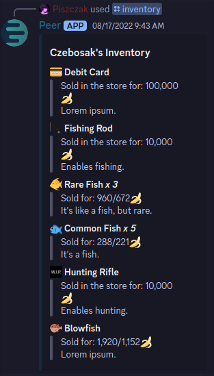
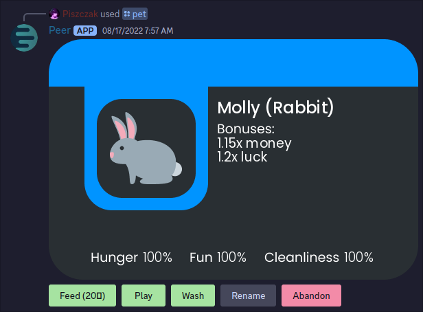
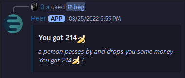
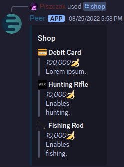

# Peer
### A discord mod I worked on for fun in 2022 for 3-5 months.
---
The bot is unfinished and has undocumented code, but I hacked it together to launch. Some features may not work.
It had many features, but unfortonately I lost the newest version and along with it some features like pets.

This project has 1500 lines of pure code and is by far my biggest so far.
# Dependencies
The dependencies are all in requirements.txt, to install them just run the command below
```
pip install -r requirements.txt
```

# Running
To run the bot you need to set the `PEER_TOKEN` environment variable to your bot's token. This can be done by placing this before your normal command
```
PEER_TOKEN="your token"
```
You can also add an environment variable permamently, without having to type it in each time. Look up a tutorial for your os.

# Images






